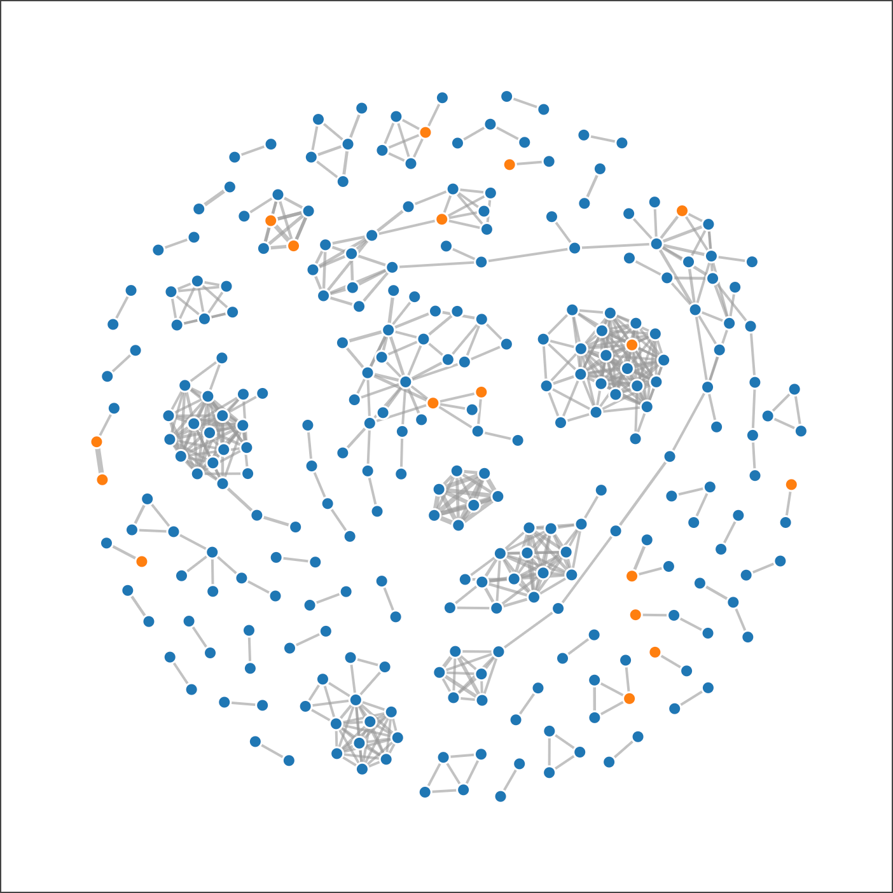
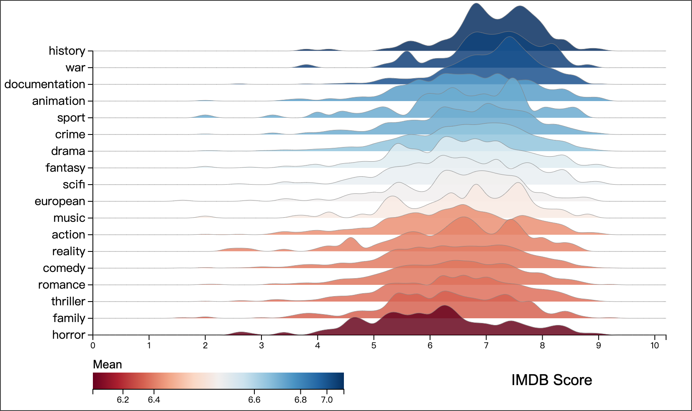
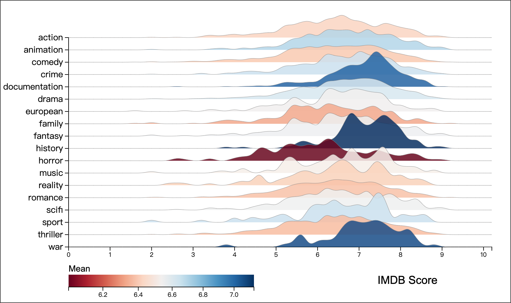
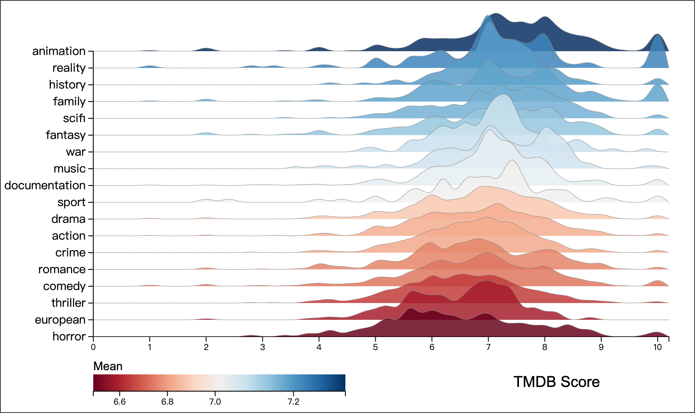
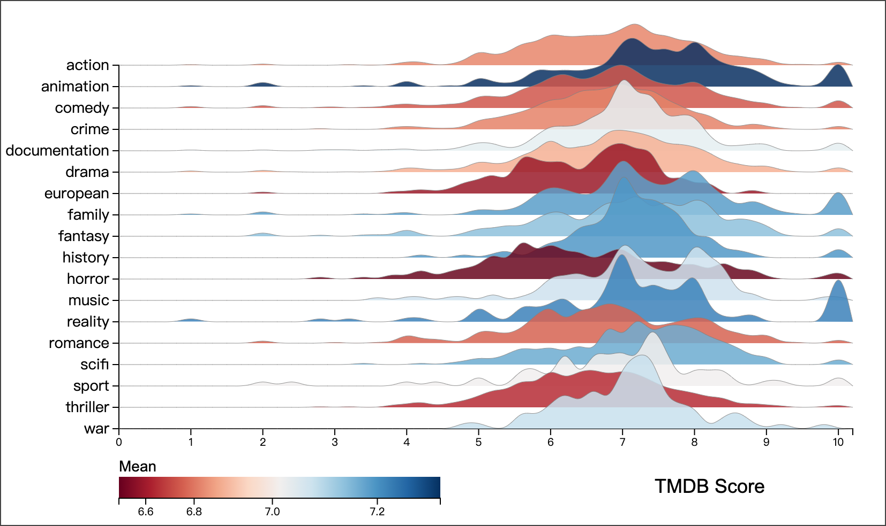
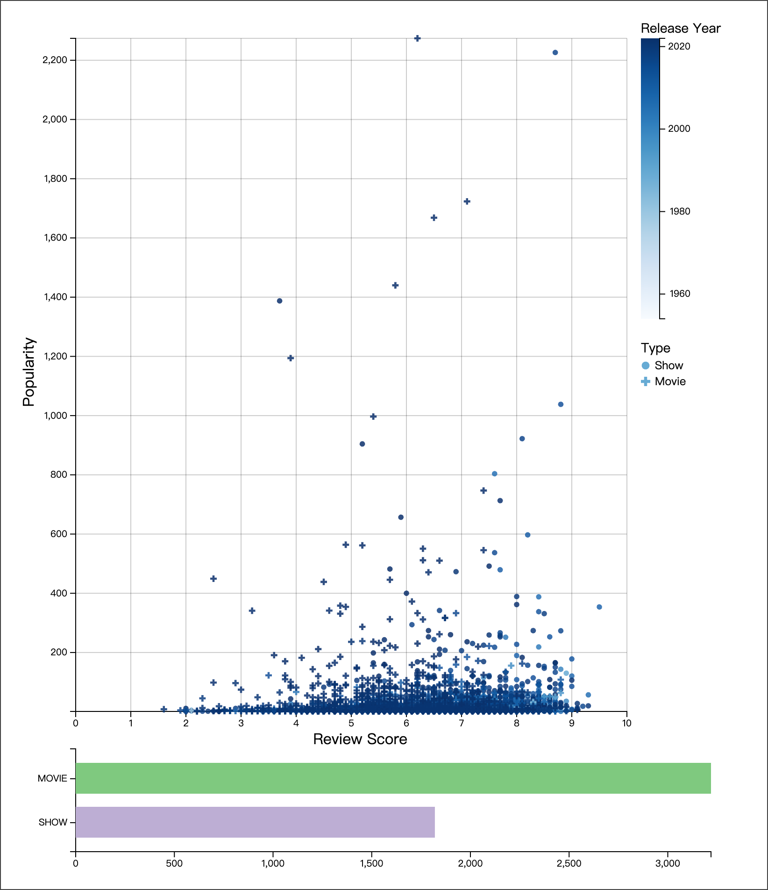
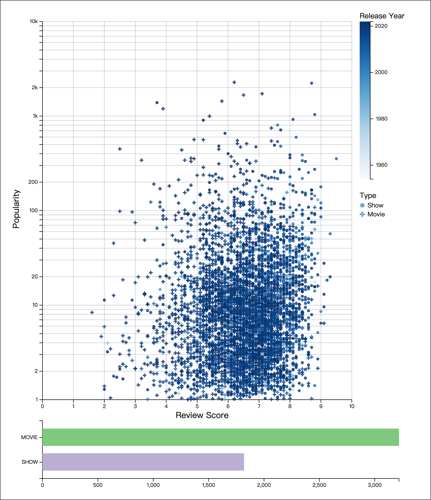
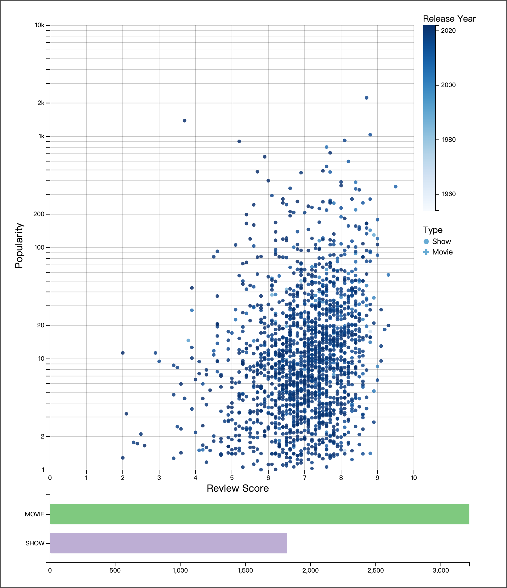

# INF 552

## Visualizations

### Collaborative Relationship

As to the modelling of collaborative relationships between actors and 
directors, we first introduce our data-mining strategy. We define 
'popularity' for actors and directors based on their participation 
in a minimum of four movies or shows. We then establish a network to 
map collaboration relationships, exclusively considering 'strong 
collaborations' characterized by at least four joint projects.

In our network visualization, directors are represented by orange 
nodes, while actors are depicted with blue nodes. The strength of 
each collaborative link is quantified by the number of joint projects
and visually represented by the stroke of the edge.

Given the presence of multiple disjoint subgraphs within the network,
we employ a disjoint force-directed graph approach, which enables us
to maintain the visibility of separate subgraphs within a single
viewport, facilitating comprehensive analysis. Further enhancing the 
utility of this visualization, we have integrated an interactive 
feature: when a user hovers over any node or link in the graph, 
a tooltip window is triggered. This window provides detailed 
information, such as the name of the actor or director represented 
by a node, or the complete list of collaborative projects associated 
with a link between two nodes. This interactive component of the 
visualization gives users a deeper understanding of the collaborative 
dynamics within the network.

### Distribution of Review Score

In this section, we employ a ridgeline plot to elucidate the 
distribution of review scores across various genres. This 
visualization is enhanced by a diverging color scheme, which is 
aligned with the mean review scores to distinctly highlight genres 
with comparatively higher or lower ratings. These ratings are 
aggregated from two prominent film review platforms: IMDb and TMDb.

Furthermore, the plot offers two distinct sorting options for users: 
an alphabetical arrangement of genres and an ordering based on their 
mean scores. Enhanced interactivity is a pivotal feature of this 
visualization. Specifically, when users hover over any section of 
the density plot, the corresponding area is accentuated through a 
change in opacity, an emboldening of the ridgeline, and a display of 
the genre’s mean score. This interactive element is designed to 
provide an informative user experience, facilitating a deeper 
understanding of the data.

Ridgeline plot on IMDB score distribution, ordered by mean score

Ridgeline plot on IMDB score distribution, ordered by alphabet

Ridgeline plot on TMDB score distribution, ordered by mean score

Ridgeline plot on TMDB score distribution, ordered by alphabet

### Correlation between Review Score and Popularity

In this section, we present a scatterplot to analyze the correlation 
between popularity and review scores of media content. Considering 
the significant variation in the distribution of popularity data, 
the scatterplot is equipped with a scale that users can toggle 
between linear and logarithmic, enhancing the visual interpretability 
of the data. The scatterplot is enriched with a linear color scheme, 
which corresponds to the release year of the media content. Distinct 
shapes are utilized to differentiate between movies and shows.

To further aid in the comparative analysis of movies and shows, a 
histogram is displayed beneath the scatterplot. This histogram shows 
the count of different Netflix media types. Interactivity is a 
key feature here: when users select either of the bars in the 
histogram, the scatterplot dynamically updates to display only 
the data points corresponding to the selected media type. Moreover, 
when users hover over a data point in the scatterplot, a tooltip 
window appears, providing the name of the media. This design not 
only enhances user engagement but also offers insightful and 
tailored views of the data.

scatterplot, linear scale

scatterplot, log scale

scatterplot of movie type, linear scale

scatterplot of show type, log scale
